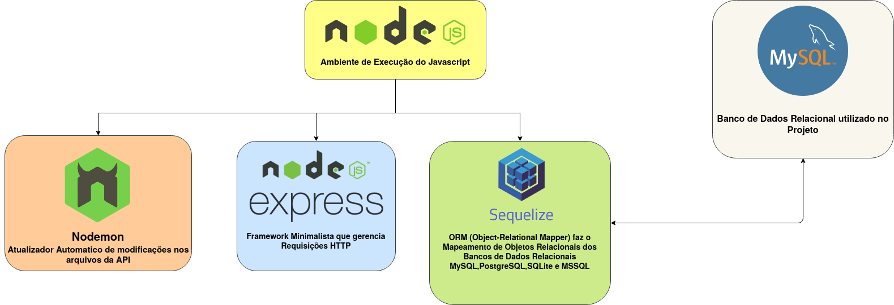

# Estrutura Básica de uma API RESTful detalhada

### Estrutura de Diretórios

⟶ = 27F6

```text
src/
 | ⟶ api/
 |    | ⟶ controllers/
 |    | ⟶ models/
 |    | ⟶ routes/
 |    | ⟶ sql/
 | ⟶ postman/
```


### Como Estudar

* Cada Diretório possui um `README.md` que explica e detalha como foi feito essa API e uma das formas de construir uma API RESTful em Javascript.
* A ordem de READMEs são:

1. [Esta é a Página Inicial](README.md)
2. [Diretório src/api/](src/api/README.md)
3. [Diretório src/api/models/](src/api/models/README.md)
4. [Diretório src/api/controllers/](src/api/controllers/README.md)
5. [Diretório src/api/routes/](src/api/routes/README.md)
6. [Diretório src/postman/](src/postman/README.md)

### Programas utilizados e como instalar

1. Postman - Programa que Auxilia no Teste e Documentação das Rotas da API
   1. Acesso o site oficial de Download [AQUI](https://www.postman.com/downloads/)
   2. Documentação de uso [AQUI](src/postman/README.md)
2. Nodejs - Ambiente de Execução de Programas em Javascript
   1. Documentação de Instalação e uso [AQUI](markdown/nodejs.md)
3. Express - Framework Minimalista que gerencia Requisições HTTP
   1. Documentação de Instalação e uso [AQUI](markdown/express.md)


