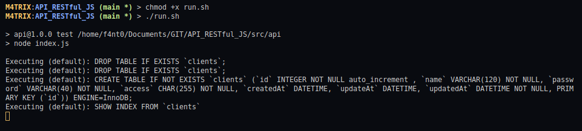
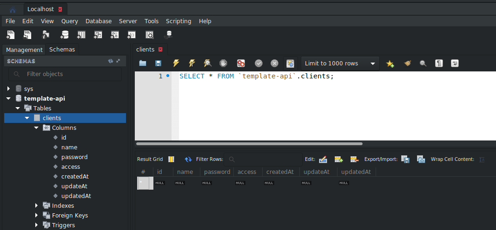
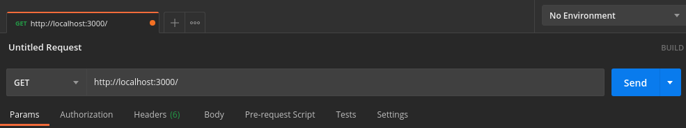
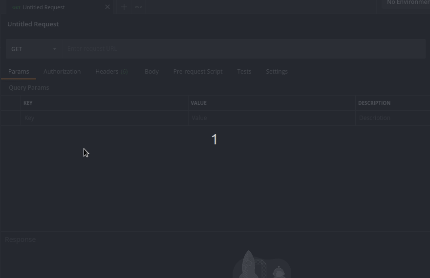
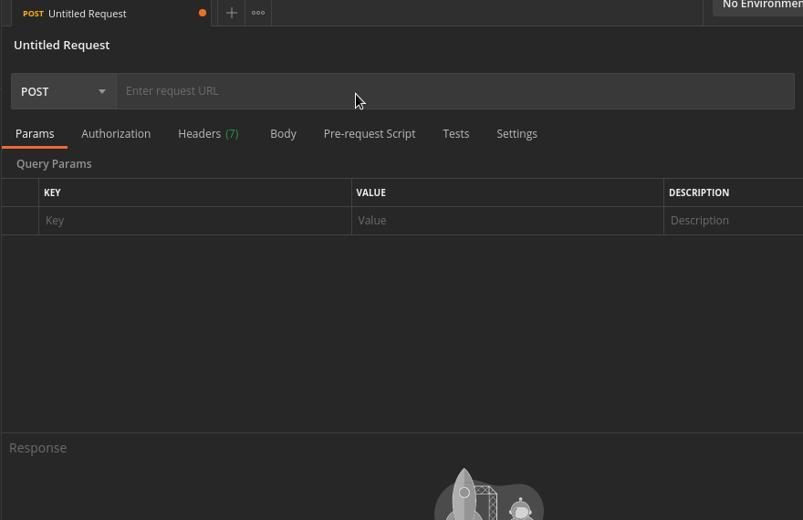
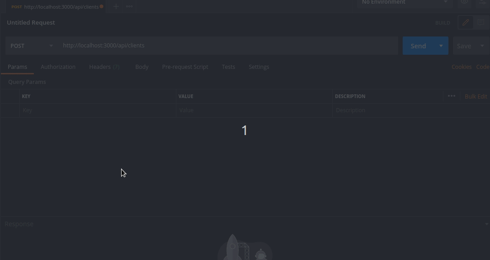

<h1>Glossário</h1>

1. [Página Inicial](https://estudosdofantinho.github.io/API_RESTful_JS/).
2. [O que é uma API](1-O-que-é-uma-api.md).
3. [Como criar um Servidor Inicial](2-Servidor-Inicial.md).
4. [Baixando e Configurando o Express](3-Configurando-Express.md).
5. [Configurando o Sequelize para o Banco de Dados](4-Configurando-Banco-de-Dados.md).
6. [Criando um Model](5-Criando-um-Model.md).
7. [Criando um Controller](6-Criando-um-Controller.md).
8. [Criando um Route](7-Criando-um-Route.md).
9. [Tratamento de Erros Globais](8-Tratamento-de-Erros-Globais.md).
10. [Conectando o Banco de Dados no Servidor](9-Conectando-Banco-de-Dados.md).
11. [Testando a API](10-Testando-a-API.md).

---

# Testando a API


### Rodando o Servidor

* Primeira coisa a fazer é criar um Script para rodarmos o Servidor, onde eu criei esse Script alterando o nosso arquivo _package.json_:

```json
{
  "name": "api",
  "version": "1.0.0",
  "description": "API Example",
  "main": "index.js",
  "scripts": {
    "test": "node index.js"
  },
  "author": "Gabriel Fanto",
  "license": "ISC",
  "dependencies": {
    "express": "^4.17.1",
    "mysql2": "^2.2.5",
    "sequelize": "^6.3.5"
  }
}
```

* Como mostra na área de `scripts`, toda vez que eu rodar o comando **npm test** dentro do Diretório _api/_ ele vai rodar o Servidor, mas como nossa API não fica no Source code do Repositório, irei criar um arquivo Shell Script chamado _run.sh_ que vai acessar a API e rodar o comando do **npm test**.

```shell
#!/bin/bash

# -------------------
# RUN THE API SERVER
# ------------------

cd src/api/
npm test
```

* Para fazer esse arquivo executável, utilizei o seguinte comando no terminal no diretório dele:

```shell
> chmod +x run.sh
```

* Para executar esse Script, usamos o seguinte comando no Terminal:

```shell
./run.sh
```

* Se tudo der certo, ele vai mostrar as seguintes informações:



### Verificando o MySQL

* Se o Servidor rodar direito como acima, ele vai criar a Tabela _clients_ com todos os dados definidos no Model _api/models/clientsModel.js_ e com isso também criando as colunas na Tabela, como mostra a imagem abaixo:



### Colocando mensagem com URL

* Uma coisa que faltou era uma Mensagem de onde a nossa API está rodando, onde iremos colocar a seguinte mensagem dentro do `server.listen()`:

```javascript
server.listen(port, () => {
        console.log(`Server Running at http://localhost:${port}/`);
});
```

### Testando no Postman

* Agora temos tudo pronto e se tudo der certo todas as Rotas irão funcionar.
* Para testarmos as nossas Rotas iremos utilizar o [Postman](postman) para testarmos as Rotas, de uma forma bem simples, onde a primeira coisa que iremos fazer é deixar o **Servidor rodando** no Terminal do VSCODE e iremos abrir o Postman instalado.
* Se desejar saber mais sobre o Postman, clique neste [LINK](postman).

#### Como testar

* Como não temos nenhum dado no nosso Banco de dados, iremos criar um Dado novo testando a Rota POST pelo Postman, onde iremos criar um Dado no Formato JSON e enviar pela rota desenvolvida.

* A URL base da nossa API roda no seguinte link: 

```shell
http://localhost:3000/
```

* Então no nosso Postman, todas as Requisições irão começar com esse URL:



* Cada Requisição possui um caminho diferente, que estão definidos no arquivo routes da Tabela específica, além disso foi definido no arquivo _index.js_ que a rota principal inicial de todas as requisições é _/api_ portanto seguindo essa lógica abaixo tem uma tabela de todas as urls e o tipo de Requisição que deve ser usado no Postman:

Requisição|url dessa requisição|url completa
|---|---|---|
<code style="color: green">GET</code>|/clients/:id|http://localhost:3000/api/clients/:id
<code style="color: green">GET</code>|/clients|http://localhost:3000/api/clients
<code style="color: gold">POST</code>|/clients|http://localhost:3000/api/clients
<code style="color: blue">PUT</code>|/clients/:id|http://localhost:3000/api/clients/:id
<code style="color: red">DELETE</code>|/clients/:id|http://localhost:3000/api/clients/:id

* Como se pode ver bem, tem urls parecidas, como no caso do primeiro GET, o PUT e o DELETE, mas são Requisições diferentes feitos nessas urls
* Agora vou mostrar como fazer a requisição de cada uma dessas Requisições

---

### Testando o POST

* <code style="color: gold">POST</code> vai ser o nosso Primeiro teste devido que não temos dados dentro de nosso Banco de dados, portanto vamos criar um.
* Primeira coisa é alterarmos o tipo de Requisição que vamos fazer no Postman, como no GIF abaixo:



* Agora iremos colocar a url definido para o POST: `http://localhost:3000/api/clients`:



* Este momento, iremos construir o JSON com os dados para colocarmos no nosso Banco de dados, onde para escrevermos o JSON, devemos ir na seguinte área do Postman:



* Nesse momento iremos colocar todos os dados necessários para criar um dado novo na nossa tabela, onde esses dados são:

Coluna|Tipo de dado
|---|---|
name|String
password|String
access|Char
createdAt|Date
updateAt|Date