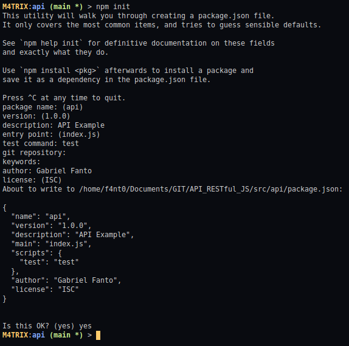
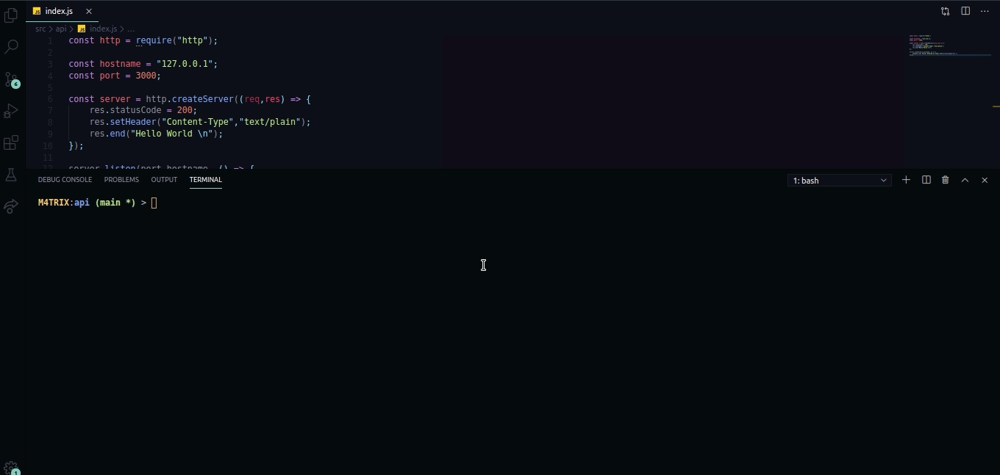

<h1>Glossário</h1>

1. [Página Inicial](https://estudosdofantinho.github.io/API_RESTful_JS/).
2. [O que é uma API](1-O-que-é-uma-api.md).
3. [Como criar um Servidor Inicial](2-Servidor-Inicial.md).
4. [Baixando e Configurando o Express](3-Configurando-Express.md).
5. [Configurando o Sequelize para o Banco de Dados](4-Configurando-Banco-de-Dados.md).

---

# Iniciando uma API com Nodejs

### Como foi iniciado o Projeto

* Primeiro foi construido a estrutura de Diretórios mostrado abaixo:

```text
src/
 | ⟶ api/
 |    | ⟶ controllers/
 |    | ⟶ database/
 |    | ⟶ models/
 |    | ⟶ routes/
 | ⟶ postman/
```

* Dentro do Diretório _src/api/_ foi iniciado o Nodejs com o comando no Terminal: `npm init`



* Foi criado um Arquivo _package.json_ com as informações dos programas extras e dados importantes na hora da configuração apresentado acima.

```json
{
  "name": "api",
  "version": "1.0.0",
  "description": "API Example",
  "main": "index.js",
  "scripts": {
    "test": "test"
  },
  "author": "Gabriel Fanto",
  "license": "ISC"
}
```

### Como criar o Servidor da API

**Importando o Módulo HTTP**

* Uma API para ser utilizada e testar em Javascript é preciso criar um Servidor que vai ficar rodando em uma porta de rede específica e para isso iremos usar um Módulo do Node chamado **HTTP**.
* O módulo HTTP já vem junto com o Node, por isso não precisa ser instalado.
* Como mostrado na inicialização do projeto Nodejs, o nosso arquivo principal para rodar é o **index.js**, portanto precisamos criar ele dentro do diretório _api/_ onde fica o nosso package.json.
* Com o arquivo criado, devemos importar o módulo HTTP dentro desse arquivo com o código abaixo:
  
```javascript
const http = require("http");
```

* Agora devemos também definir o HOSTNAME (que é onde a nossa API vai rodar) onde o padrão é o Localhost, com o seguinte código: **127.0.0.1**.
* E agora a Porta onde vai ficar ativo a API enquando estiver online, onde o padrão é a porta 3000. 
* No código fica as seguinte Variáveis constantes:

```javascript
const hostname = "127.0.0.1";
const port = 3000;
```

**Criando um Servidor**

* Agora que temos importado o módulo HTTP, iremos criar o Servidor em uma variável chamada _server_.
* O módulo HTTP possui uma Função chamada `createServer()` que como o nome já diz, vai criar o Servidor:

```javascript
const server = http.createServer();
``` 

* Iremos passar uma **Requisição** e uma **Resposta** utilizando [Arrow Functions](https://www.w3schools.com/js/js_arrow_function.asp).
  * **Requisição (Request)**: é um pedido que o cliente faz para a API, onde dependendo da requisição ele entrega uma resposta diferente
  * **Resposta (Response)**: é a resposta que deve ser entregue ao cliente, dependendo da requisição pedida
  
```javascript
const server = http.createServer((req,res) => {
    //...
});
```

* Agora temos que dizer os dados necessários como resposta quando for inicializado o servidor, para isso temos que definir as seguintes opções:
  * **Status do Código (Status code)**: é o valor em inteiro do status que tem que enviar, sendo o padrão **200**.
  * **Header**: qual é o tipo de conteúdo que vai ser apresentado utilizando uma Função `setHeader()`, onde nesse momento vai ser texto puro.
  * **Saída**: como teste, utilizando a Função `end()` iremos transmitir uma resposta de texto para o Browser com um Hello World.

```javascript
const server = http.createServer((req,res) => {
    //Status
    res.statusCode = 200;
    
    //Header
    res.setHeader("Content-Type","text/plain");

    //Mensagem
    res.end("Hello World \n");
});
```

* Temos então a nossa constante chamada server, onde ele vai criar um Servidor e enviar o dados definidos, agora temos que chamar esse Servidor, onde utilizamos a Função `listen()` que vai ficar "ouvindo" as requisições e enviando uma resposta caso necessário, com isso ele vai ficar ativo enquanto o programa estiver rodando no Terminal.
* Dentro da Função `listen()` iremos chamar a **Porta** que definimos, o **Hostname** definido e ainda iremos criar uma Arrow Function vazia onde vamos criar um _Console.log_ dizendo a URL de onde o nosso servidor pode ser acessado.

```javascript
server.listen(port,hostname, () => {
    // aspas simples para a esquerda fazem com que possamos adicionar variaveis na String
    console.log(`Server Running at http://${hostname}:${port}/`);
});
```

Pronto, com isso temos um Servidor da API, onde podemos fazer as requisições enquanto a API estiver online.

**Apresentando em GIF**

* Abaixo, foi inciado o servidor e clicado no link, onde podemos ver nosso Hello World no Browser.

