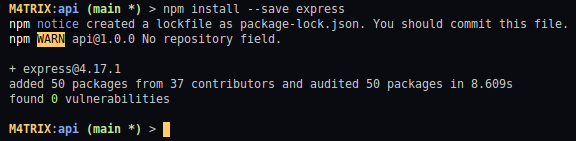
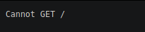

# Entendendo e utilizando o Express

### Instalação

* Para instalar o Express no Nodejs iremos utilizar o **npm** que vem instalado com o Nodejs
* O seguinte comando no Terminal irá instalar o Express em nosso Projeto

```shell
> npm install --save express
```

**Na prática**



* a tag `--save` faz com que o Módulo seja configurado junto no package.json, evitando de ter que escrever manualmente.

### O que é

* **Express** é um `Framework` que permite construir aplicações a partir de `Middlewares`
  * **Framework** é um Template de Funções que podem ser usados pelo Desenvolvedor em diferentes projetos,onde possui Funções,Classes e Objetos Abstratos para uso em Geral. É útil para não precisar reescrever código sempre que precisa de uma utilização.
  * **Middlewares** é um tipo de Função que está entre um pedido HTTP e a resposta final que o Servidor envia de volta para o cliente. Todos os Métodos dentro de um [Controller]() são Middlewares, funções que retornam um 404 é um Middleware, Função que retorna um Erro.

### Utilização

* O Express vai nos ajudar a melhorar o Servidor criado [aqui](initialization). Ele vai nos ajudar a tratar com as requisições HTTP em nosso código.
* Primeira coisa que devemos fazer é importar o Express em nosso Servidor, que fica no arquivo **Index.js** no diretório **src/api/**:

```javascript
const express = require("express");
```

* Agora que importamos o express, iremos criar uma constante chamada **app** onde iremos iniciar o express, utilizando a Função `express()`:

```javascript
const app = express();
```

* tendo agora inicializado o express, precisamos dizer a porta que ele vai ficar ouvindo as requisições, onde já temos uma constante chamada **port** onde temos especificado a porta, dessa forma, agora temos que usar a Função `set()` dizendo qual vai ser a porta que ficará ouvindo:

```javascript
const port = 3000;

app.set("port",port);

```

* E por fim, para que as requisições possam passar pelo app, iremos definir o app como local onde as requisições passam quando criamos o Servidor, por isso iremos limpar os dados da Função `createServer()` utilizado na constante **server** utilizando o módulo HTTP:

_Antes_

```javascript
const server = http.createServer((req,res) => {
    res.statusCode = 200;
    res.setHeader("Content-Type","text/plain");
    res.end("Hello World \n");
});
```

_Depois_

```javascript
const server = http.createServer(app);
```

* Agora o nosso projeto está ouvindo requisições, neste momento ele não faz nenhuma requisição, porque ainda não foi identificado as requisições.
* Por isso, se for rodar o projeto, vai aparecer uma mensagem no Browser dizendo:

```txt
Cannot GET/
```




### Desenvolvendo Middlewares com o Express

Como explicado anteriormente, um Middleware é o que fica entre uma Requisição HTTP e a resposta final que o Servidor envia, onde são esses Middlewares que o Express ajuda a construir

Nosso primeiro Middleware que iremos construir é o da Resposta **404** que é o código da web para dizer que uma página não foi encontrada.

Para desenvolver um Middleware, iremos usar a Função `use()` do Express para definirmos os Middlewares necessários.

Iremos passar para a Função use() uma Função usando Arrow Function(Função interna de uma Função) um _request_ (Requisição feita para a API), um _response_ (Resposta do Servidor para o Browser) e um _next_ (se for necessário passar informação a outro Middleware, podemos ter vários Middlewares encadeados).

```javascript
app.use((request,response,next) => {
    //...
});
```

**Middleware 404**

utilizando o _response_ chamado pelo Arrow Function interno da Função `use()` iremos enviar o código **404** utilizando a Função `status()` e depois usamos a Função `send()` para enviar essa mensagem para o Browser, como abaixo:

```javascript
app.use((request,response,next) => {
    response.status(404).send('404 - Request not Found!');
});
```
Com esse Middleware, se uma Requisição que não existe na API ou não foi implementada, ele vai enviar a mensagem _404 - Request not Found!_ que irá aparecer no Browser.


