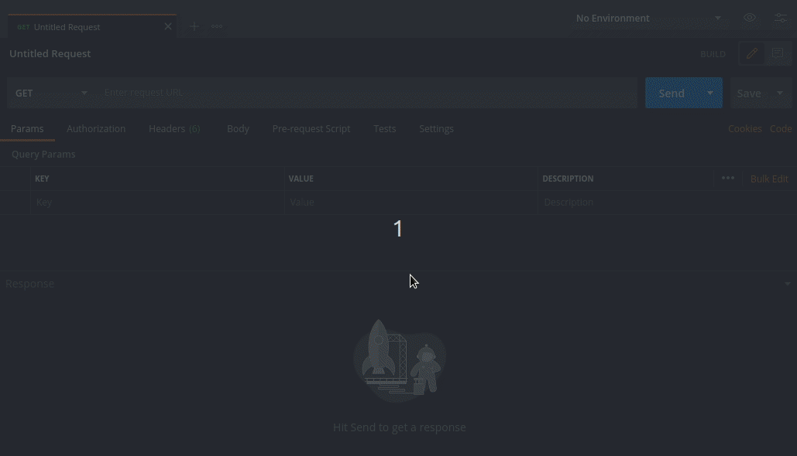

<h1>Glossário</h1>

1. [Página Inicial](https://estudosdofantinho.github.io/API_RESTful_JS/).
2. [O que é uma API](1-O-que-é-uma-api.md).
3. [Como criar um Servidor Inicial](2-Servidor-Inicial.md).
4. [Baixando e Configurando o Express](3-Configurando-Express.md).
5. [Configurando o Sequelize para o Banco de Dados](4-Configurando-Banco-de-Dados.md).
6. [Criando um Model](5-Criando-um-Model.md).
7. [Criando um Controller](6-Criando-um-Controller.md).
8. [Criando um Route](7-Criando-um-Route.md).
9. [Tratamento de Erros Globais](8-Tratamento-de-Erros-Globais.md).
10. [Conectando o Banco de Dados no Servidor](9-Conectando-Banco-de-Dados.md).
11. [Testando a API](10-Testando-a-API.md).

---

# Criando um Controller na API

**Controller** são Funções que irão ajudar na interação entre o Model com as Requisições feitas para a API, onde esses Controllers auxiliam no _Request_ e _Response_ que serão transmitidas, sendo uma Forma de Controle das Requisições.

#### Chamando o Model

* Antes de começarmos a implementar nosso Controller, precisamos importar o Model que será vinculado a esse Controller, como no caso queremos criar o Controller do Model _Clients_, devemos importar ele dentro do nosso Controller.
* Essa Importação devemos colocar o mesmo nome do export do Model, como abaixo:

Export do _clientsModel_:

```javascript
module.exports = Clients;
```

Nome da Importação do Model no Controller:

```javascript
const Clients = require("../Models/clientsModel");
```

#### Utilizando o exports

* a palavra **exports** irá exportar um objeto, como vimos anteriormente com `module.exports` utilizado para exportar um objeto.
* Iremos usar uma sintaxe onde iremos usar o exports com o nome do método que iremos implementar para pegar os objetos, como abaixo:

```javascript
exports.nomeMetodo = //...
```

#### Enviando um Middleware para o método

* Com o método definido, utlizamos um Middleware como fizemos no arquivo _index.js_ para a utilização da Função `use()` do Express, como exemplo abaixo:

```javascript
exports.nomeMetodo = (request,response,next) => {
    //...
};
```

* Esses middlewares vão ser o principal do Controller, onde cada Middleware vai fazer um pedido diferente para o nosso Model

#### Quais os Middlewares utilizados

Ao todo serão 5 Middlewares utilizados para buscar os dados do Cliente:

1. Pegar um Cliente = **findOne**.
2. Pegar todos os Clientes = **findAll**.
3. Criar um cliente = **create**.
4. Atualizar um cliente = **update**.
5. Deletar um cliente = **delete**.

#### Implementação desses Middlewares no Controller

O primeiro Middleware que vamos criar é o de Pegar um Cliente do Banco de dados.

---

<center>
    <code style="color: green">findOne</code>
</center>

* Começamos criando o export e o inicio do middleware do Método findOne:

```javascript
exports.findOne = (request,response,next) => {
    //...
};
```

* Como vamos pegar um dado do Banco de dados e a forma de encontrar esse dado é pela Requisição do ID do Cliente em nossa Rota (que será mostrado mais tarde) então devemos pegar esse ID passado pelo _request_.
  * Esse ID que iremos pegar será armazenado em uma constante chamada id, onde com ela iremos procurar esse cliente por esse id pedido.

```javascript
exports.findOne = (request,response,next) => {
    const id = request.params.id;
    //...
};
```

* Agora que temos o ID, vamos utilizar o nosso Model importado para procurar esse cliente.
* O Sequelize quando criamos o nosso modelo **Clients** ele já possui Funções para nos ajudar a fazer as requisições no banco de dados.
* A Função que iremos usar nesse Middleware vai ser o `findByPk()` que iremos passar como Parâmetro o ID recebido do Request e salvo na constante id:

```javascript
// o Import
const Clients = require("../models/clientsModel");

exports.findOne = (request,response,next) => {
    const id = request.params.id;

    // Utilizando a Função findById
    Clients.findByPk(id)
};
```
* A função `findByPk()` vai nos retornar uma **Promise**:
  * **Promise** = é um objeto usado para processamento assíncrono. Um Promise (de promessa) representa um valor que pode estar disponível agora, no futuro ou nunca, portanto devemos tratar essa Promise dependendo do que for retornado.
* Como ele é uma Promise, **Devemos tratar esse processo Assíncrono** onde podemos usar as seguintes Funções:

Método `then()` = É onde registramos o que queremos que aconteça quando a Promise for resolvida.

Método `catch()` = É onde registramos o que queremos que aconteça quando a Promise falhar.

**Utilizando a Função then**

* No nosso caso tem duas coisas que queremos que essa promise faça:
  * Caso exista um Cliente com o id passado, devemos enviar os dados desse cliente pelo _response_ utilizando a Função `send()`, onde ele vai enviar esses dados do banco de dados para o Browser, ou programa onde esta API estiver conectada
  * Caso não exista um Cliente devemos enviar um resposta 404 com um texto informando que esse cliente não existe.
* Para fazermos isso iremos chamar a Função `then()` e dentro dele iremos criar uma Arrow Function tratando essas duas opções:

```javascript
exports.findOne = (request,response,next) => {
    const id = request.params.id;

    Clients.findByPk(id).then(client => {
        if(client){
            response.send(client);
        }else{
            response.status(404).send(`Cliente with ID ${id} not Found!`);
        }
    })
};
```

* Podemos ver que criamos _client_ que vai pegar o resultado da Promise e com ele dentro da Arrow Function vai ser verificado se o cliente existe ou não dentro do banco de dados, onde se não existir, vai enviar um 404 e uma mensagem dizendo que o cliente com aquele id não existe dentro do banco de dados.

**Utilizando a Função catch**

* Caso aconteça um Erro com o banco de dados ou algum erro inesperado, iremos utilizar o Express para enviar esse erro para o proximo Middleware, onde dai não precisamos nos preocupar com esse erro em nosso projeto.
* Então criamos um Arrow function que vai pegar o erro inesperado caso aconteça e o passe para outro Middleware utilizando o _next_ que temos como parâmetro:

```javascript
exports.findOne = (request,response,next) => {
    const id = request.params.id;

    Clients.findByPk(id).then(client => {
        if(client){
            response.send(client);
        }else{
            response.status(404).send(`Client with ID ${id} not Found!`);
        }
    }).catch(error => next(error));
};
```
---

<center>
    <code style="color: green">findAll</code>
</center>


* Para esse Middleware iremos implementar junto uma **Paginação**.
  * **Paginação** nos ajuda a pegar um numero de dados por vez, de vez de pegar todos os dados de uma única vez, que se for muitos dados de uma única vez pode prejudicar nosso banco de dados ou demorar demais para apresentar os dados para podermos verificar, sendo uma boa idéia para um projeto com muitos dados.
* Primeira coisa que devemos fazer é consruir o Template do Middleware:

```javascript 
exports.findAll = (request,response,next) => {
    //...
};
```
* Agora vem uma parte bem complexa, iremos enviar com o _request_ para a nossa API valores do **limite de informações de uma pagina** e o **numero da pagina** como no exemplo abaixo:

```text
localhost:3000/.../.../?limit=10&page=0
```

* Nesse exemplo simples, podemos ver que o parâmeto _limit_ envia um número, que é 10 e o parâmetro _page_ vai enviar um número também, que é 0. Esses parâmetros devem ser pegos pelo Método findAll e tratar eles, onde:
  * _limit_ é o número de dados limites de uma página, no caso acima são 10 dados por página.
  * _page_ é o número da página, onde no exemplo queremos a página 0.
* Agora como vamos pegar essas dados no nosso Middleware? como abaixo:

```javascript
exports.findAll = (request,response,next) => {
    let limit = parseInt(request.query.limit || 0);
    let page = parseInt(request.query.page || 0);
    //...
};
```
* Essas duas variáveis estão pegando os parâmetros colocados na requisição e transformando em um valor inteiro e se não existir esses parâmetros ele retorna zero nas duas variáveis.

* Se esses dados não forem inteiros, eu devo enviar uma mensagem de Erro como resposta, complementando o código acima com as seguintes linhas:

```javascript
exports.findAll = (request,response,next) => {
    let limit = parseInt(request.query.limit || 0);
    let page = parseInt(request.query.page || 0);
    
    if(!Number.isInteger(limit) || !Number.isInteger(page)){
        response.status(400).send("limit or page are not Numbers!");
    }

    //...
};
```

* Essa verificação irá ver se algum dos dois dados é ou não um Inteiro e se não for ele vai retornar o Status 400, que significa _Bad Request_ onde para leigos significa que deu um problema no request e com isso é enviado a mensagem que ou o limite ou a pagina do parâmetro não é um Número.

* Beleza, agora devemos verificar se esses parâmetros são valores possíveis no programa,onde teremos que fazer um cálculo para ver se o limite e a página estão dentro dos valores possiveis.

* Para isso, preciso definir qual o numero maximo de dados desejo que apareça por página, para isso eu crio uma constante que vai possuir o meu numero máximo desejado, como por exemplo 10 dados por página:

```javascript
exports.findAll = (request,response,next) => {
    let limit = parseInt(request.query.limit || 0);
    let page = parseInt(request.query.page || 0);
    
    if(!Number.isInteger(limit) || !Number.isInteger(page)){
        response.status(400).send("limit or page are not Numbers!");
    }

    const MAX_PAGE_ITENS = 10;

    //...
};
```

* Nesse momento então eu irei verificar, utilizando um **IF simplificado** se os valores passados pelo _limit_ e pelo _page_ estão dentro dos limites que desejo:
  * **IF simplificado**: `verificação ? resultado se true : resultado se false`

```javascript
exports.findAll = (request,response,next) => {
    let limit = parseInt(request.query.limit || 0);
    let page = parseInt(request.query.page || 0);
    
    if(!Number.isInteger(limit) || !Number.isInteger(page)){
        response.status(400).send("limit or page are not Numbers!");
    }

    const MAX_PAGE_ITENS = 10;

    limit = limit > MAX_PAGE_ITENS || limit <= 0 ? MAX_PAGE_ITENS : limit;
    page = page <= 0 ? 0 : page * limit;

    //...
};
```

* Entendendo esses testes:

`limit = limit > MAX_PAGE_ITENS || limit <= 0 ? MAX_PAGE_ITENS : limit;` pode ser visto em sua forma antiga como:

```javascript
if(limit > MAX_PAGE_ITENS || limit <= 0){
    limit = MAX_PAGE_ITENS;
}else{
    limit = limit;
}
```
* Ou seja, se o limite for maior que o máximo que pode por página ou se o limite for menor que zero, o valor do limite vai ser sobrescrito com o valor da nossa constante MAX_PAGE_ITENS que tem como valor 10 dados por página. Se tiver em um valor dentro do limite possivel, o valor do limite se mantém o valor entrado.

`page = page <= 0 ? 0 : page * limit;` : não podemos ter uma página negativa, portanto se entrar como parâmetro um número negativo ele vai sempre acessar a página zero, se for um número de página possivel, ele vai pegar o numero da página e multiplicar pelo valor do limite.

* Agora que fizemos todas as verificações necessárias, podemos utilizar a Função `findAll` do Sequelize para pegarmos os dados desejados do banco, onde iremos passar como parâmetro o _limit_ e o _page_:

```javascript
exports.findAll = (request,response,next) => {
    let limit = parseInt(request.query.limit || 0);
    let page = parseInt(request.query.page || 0);
    
    if(!Number.isInteger(limit) || !Number.isInteger(page)){
        response.status(400).send("limit or page are not Numbers!");
    }

    const MAX_PAGE_ITENS = 10;

    limit = limit > MAX_PAGE_ITENS || limit <= 0 ? MAX_PAGE_ITENS : limit;
    page = page <= 0 ? 0 : page * limit;

    Clients.findAll({limit: limit, offset: page})
    
};
```

* Os atributos _limit_ e _offset_ serão usados pelo Sequelize para criar a Cláusula LIMIT em nosso SGBD, que no caso é o MySQL para paginar os dados que estão armazenados no banco de dados.

* E por fim, nesse Middleware, iremos utilizar as Funções `then()` e `catch()` para lidarmos com os dados pegos nessa Promise findAll:

```javascript
exports.findAll = (request,response,next) => {
    let limit = parseInt(request.query.limit || 0);
    let page = parseInt(request.query.page || 0);
    
    if(!Number.isInteger(limit) || !Number.isInteger(page)){
        response.status(400).send("limit or page are not Numbers!");
    }

    const MAX_PAGE_ITENS = 10;

    limit = limit > MAX_PAGE_ITENS || limit <= 0 ? MAX_PAGE_ITENS : limit;
    page = page <= 0 ? 0 : page * limit;

    Clients.findAll({limit: limit, offset: page}).then(clients => {
        response.send(clients);
    }).catch(error => next(error));
    
};
```
* Então no fim, o `then()` vai enviar no _response_ todos os dados adquiridos do Promise e enviar para o programa ou para o Browser ou para o Postman no nosso caso.

---

<center>
    <code style="color: cyan">create</code>
</center>


* Este Método ele é bem interessante e peculiar, porque com ele iremos criar um novo cliente e para isso nós iremos pegar um JSON com os dados necessários para criar um novo Cliente.
* Como estamos usando o Postman para fazer as Requisições, ele vai nos ajudar a construir e enviar para a Requisição os dados, como no GIF abaixo de exemplo:



* Mas vamos começar pelo inicio, a estrutura base do Middleware:

```javascript
exports.create = (request,response,next) => {
    //...
};
```

* como visto no GIF, iremos escrever as informações em formato JSON e fazer essa Requisição com esses dados, portanto devemos ter como conseguir capturar esses dados, onde iremos utilizar essas constantes:

```javascript
exports.create = (request,response,next) => {
    const name = request.body.name;
    const password = request.body.password;
    const access = request.body.access;
    //...
};
```
* como mostrado acima, iremos pegar do _body_ da requisição os dados que foram entrados como JSON pelo _request_.
* E agora, iremos pegar esses dados que foram entrados e utilizar a Função `create()` do Sequelize para criarmos um novo dado para o nosso banco de dados, onde iremos adicionar essas constantes em um novo Objeto Javascript:

```javascript
exports.create = (request,response,next) => {
    const name = request.body.name;
    const password = request.body.password;
    const access = request.body.access;
    
    Clients.create({
        name: name,
        password: password,
        access: access,
    })
};
```

* E por fim, utilizar a Função `then()` e enviar o código 201 que significa que deu OK e os dados foram armazenados no Banco de dados, além do `catch()`:

```javascript
exports.create = (request,response,next) => {
    const name = request.body.name;
    const password = request.body.password;
    const access = request.body.access;
    
    Clients.create({
        name: name,
        password: password,
        access: access,
    }).then(() => {
        response.status(201).send("Client created!");
    }).catch(error => next(error))
};
```

---

<center>
    <code style="color: gold">update</code>
</center>


* O Middleware do Update também trabalha com JSON como o create, mas na hora de fazer a requisição é passado o ID do dado que deseja modificar, sendo esse a grande diferença, porque ele vai ter que pegar o dado com o id determinado como parâmetro na requisição e dai pegar os dados novos que foram adicionados pelo _body_.
* Vamos então com a estrutura base do Middleware:

```javascript
exports.update = (request,response,next) => {
    //...
};
```

* Devemos então agora criar uma constante pegando o ID passado como parâmetro, como foi feito por exemplo no Middleware `findOne`:

```javascript
exports.update = (request,response,next) => {
    const id = request.params.id;
    //...
};
```

* E agora pegar os atributos que foram passados pelo JSON, como havia sido feito no `create`:

```javascript
exports.update = (request,response,next) => {
    const id = request.params.id;
    
    const name = request.body.name;
    const password = request.body.password;
    const access = request.body.access;

    //...
};
```

* Bom, agora que temos os dados necessários, iremos utilizar 2 Funções do Sequelize para fazer um Update, onde a primeira ja foi usada pelo `findOne`, que é a Função `findByPk()` com os seus defidos `then()` e `catch()`:

```javascript
exports.update = (request,response,next) => {
    const id = request.params.id;
    
    const name = request.body.name;
    const password = request.body.password;
    const access = request.body.access;

    Clients.findByPk(id).then(client => {
        if(client){
            //...
        }else{
            response.status(404).send(`Client with ID ${id} not Found!`);
        }
    }).catch(error => next(error));
};
```

* Agora que verificamos se o Cliente com o ID passado por parâmetro existe, iremos então fazer o Update dele, dentro do if apresentado acima, onde agora vamos usar a nova Função `update()` do Sequelize:

```javascript
exports.update = (request,response,next) => {
    const id = request.params.id;
    
    const name = request.body.name;
    const password = request.body.password;
    const access = request.body.access;

    Clients.findByPk(id).then(client => {
        if(client){
            Clients.update(
                {
                    name: name,
                    password: password,
                    access: access,
                },
                {
                    where: {id: id}
                }
            )
        }else{
            response.status(404).send(`Client with ID ${id} not Found!`);
        }
    }).catch(error => next(error));
};
```

* o `where` dentro da Função `update()` do Sequelize vai nos ajudar a determinar qual o Cliente que queremos atualizar, onde passamos o ID que pegamos do Parâmetro.
* Agora então falta o `then()` do Promise, onde iremos usar uma Arrow Function vazia para somente enviar que o Cliente foi atualizado com sucesso e um `catch()` caso dê erro:

```javascript
exports.update = (request,response,next) => {
    const id = request.params.id;
    
    const name = request.body.name;
    const password = request.body.password;
    const access = request.body.access;

    Clients.findByPk(id).then(client => {
        if(client){
            Clients.update(
                {
                    name: name,
                    password: password,
                    access: access,
                },
                {
                    where: {id: id}
                }
            ).then(() => {
                response.status(200).send(`Client with ID ${id} Updated!`);
            }).catch(error => next(error));
        }else{
            response.status(404).send(`Client with ID ${id} not Found!`);
        }
    }).catch(error => next(error));
};
```

**OBS**: iremos passar para a Função `update()` no primeiro parâmetro(que acima são os atributos do JSON) **SOMENTE OS DADOS NOVOS MODIFICADOS** onde quando estivermos colocando no JSON pelo Postman só iremos colocar aqueles que queremos modificar.

**OBS2**: o Status 200 é padrão, por isso se não quiser não precisa colocar ele, mas deixei para deixar um padrão de Status ja sendo usados.

---

<center>
    <code style="color: red">delete</code>
</center>


* Agora estamos no ultimo Método de um Controller, que serve para deletarmos um dado do nosso Banco de dados.
* Este Middleware é bem simples, onde a primeira coisa que se tem que fazer é construir o Template dele:

```javascript
exports.delete = (request,response,next) => {
    //...
};
```

* Para deletarmos um dado do banco de dados, iremos encontrar ele utilizando o ID passado como parâmetro na requisição, que é esse ID que vai nos ajudar a encontrar e deletar o cliente específico, para isso precisamos criar a constante para pegar o ID de entrada:

```javascript
exports.delete = (request,response,next) => {
    const id = request.params.id;
    //...
};
```

* Agora, como foi feito no Middleware `findOne` e `update`, temos que usar a Função `findByPk()` do Sequelize:

```javascript
exports.delete = (request,response,next) => {
    const id = request.params.id;
    
    Clients.findByPk(id).then(client => {
        if(client){
            //...
        }else{
            response.status(404).send(`Client with ID ${id} not Found!`);
        }
    }).catch(error => next(error));
};
```

* Neste momento, iremos utilizar uma nova Função do Sequelize chamada `destroy()` onde a única coisa que essa Função necessita é saber o ID do cliente que queremos deletar, onde iremos usar o `where` que utilizamos no update como parâmetro:

```javascript
exports.delete = (request,response,next) => {
    const id = request.params.id;
    
    Clients.findByPk(id).then(client => {
        if(client){
            Clients.destroy({
                where: {id: id}
            })
        }else{
            response.status(404).send(`Client with ID ${id} not Found!`);
        }
    }).catch(error => next(error));
};
```
* E por fim, o `then()` enviando a mensagem que deletou e o `catch()` caso de algum erro:

```javascript
exports.delete = (request,response,next) => {
    const id = request.params.id;
    
    Clients.findByPk(id).then(client => {
        if(client){
            Clients.destroy({
                where: {id: id}
            }).then(() => {
                response.status(200).send(`Client with ID ${id} Deleted!`);
            }).catch(error => next(error));
        }else{
            response.status(404).send(`Client with ID ${id} not Found!`);
        }
    }).catch(error => next(error));
};
```
* Pronto, temos agora o nosso **CRUD** com os Middlewares necessários para acessar e modificar o Banco de dados interagindo com os _requests_ e os _responses_ de cada Método.
* Todos os Métodos desse Controller se encontram no Arquivo _src/api/controllers/clientsController.js_

--- 

## PRÓXIMO PASSO

* [Criando uma Route](7-Criando-um-Route.md)