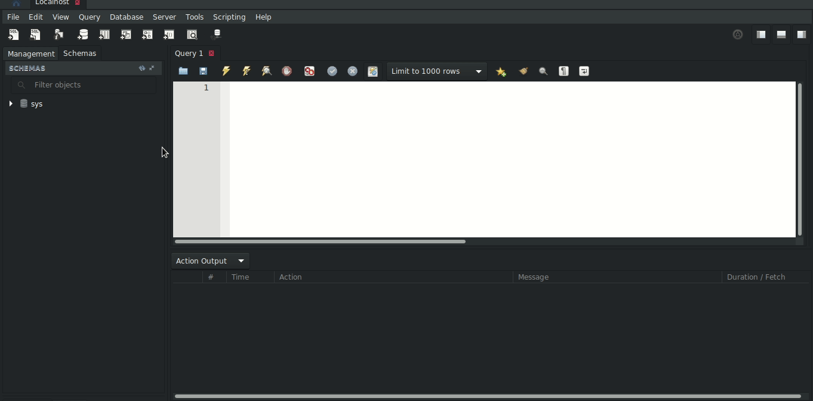

<h1>Glossário</h1>

1. [Página Inicial](https://estudosdofantinho.github.io/API_RESTful_JS/).
2. [O que é uma API](1-O-que-é-uma-api.md).
3. [Como criar um Servidor Inicial](2-Servidor-Inicial.md).
4. [Baixando e Configurando o Express](3-Configurando-Express.md).
5. [Configurando o Sequelize para o Banco de Dados](4-Configurando-Banco-de-Dados.md).
6. [Criando um Model](5-Criando-um-Model.md).
7. [Criando um Controller](6-Criando-um-Controller.md).
8. [Criando um Route](7-Criando-um-Route.md).
9. [Tratamento de Erros Globais](8-Tratamento-de-Erros-Globais.md).
10. [Conectando o Banco de Dados no Servidor](9-Conectando-Banco-de-Dados.md).
11. [Testando a API](10-Testando-a-API.md).

---

# Conectando o Banco de dados no Projeto

* Agora que temos todos os Models configurados com Sequelize, os Controllers com o Express e Sequelize e os Routes configurados, devemos conectar o nosso banco de dados configurado no Arquivo _src/api/database/database.js_ com o nosso Servidor criado no Arquivo _src/index.js_:

```javascript
//...
const sequelize = require("./database/database");
//...
```

* Devemos configurar a conexão com o banco de dados de forma que o Servidor só va ao ar se o Banco de dados estiver conectado, evitando problemas na hora de fazer qualquer requisição, por isso devemos modificar o nosso código de forma que o Banco de dados seja iniciado primeiro.

* Iremos utilizar a constante _sequelize_ para sincronizarmos com o banco de dados MySQL, para isso, iremos usar a Função `sync()` do Sequelize de vez de criarmos a constante _server_ e sua utilização, por isso iremos apagar as srguintes linhas:

```diff
- const server = http.createServer(app);
- server.listen(port,hostname, () => {
-    console.log(`Server Running at http://${hostname}:${port}/`);
- });
```

* E nos lugar desses dados, bem no final do arquivo _index.js_ irei construir a estrutura inicial da utilização da Função `sync()` do Express:

```javascript
sequelize.sync();
```

* Iremos passar um Objeto como parâmetro dentro da Função `sync()` para que automaticamente toda vez que um Module novo é criado ele deve criar uma Tabela para esse Module no nosso Banco de dados no MySQL, onde o Objeto é o seguinte:

```javascript
sequelize.sync({force: true});
```

* Com isso, a cada Module novo ele vai sincronizar com o Banco de Dados e criar uma Tabela nova.

**ATENÇÃO**

* O Sequelize não cria o Banco de dados para a gente, devemos acessar o MySQL e criar manualmente o nosso Banco de Dados, para isso acesse este [LINK](mysql) que explica como baixar e utilizar o MySQL, explicando também como criar o Banco de dados, mas abaixo deixarei um GIF mostrando como esse Banco de dados foi criado.

**ATENÇÃO 2**

* O `force` também vai fazer com que toda vez que for reiniciado o Servidor ele vai apagar e reconstruir todas as Tabelas do Banco e dados, portanto todos os dados populados serão apagados sempre que for iniciado o Servidor.

* Para uma questão de manter os dados já populados, você deve utilizar a API com `force` na primeira vez que iniciar o projeto e depois disso retirar o `force` para evitar de seus dados criados sejam apagados, então seria somente na primeira vez que for utilizar.

### Lidando com a Promise do sync

* Agora que construimos o `sync` do Sequelize, esse sync vai criar uma Promise, como aconteceu nos Controlles, e é agora utilizando a Função `then()` do sequelize que iremos tratar com essa Promise.
* Dentro da Função `then()` iremos criar uma Arrow Function vazia e é nesse momento que iremos iniciar o nosso Servidor como havia sido antigamente.
* Primeiro, criando a Arrow Function:

```javascript
sequelize.sync({force: true}).then(() => {
    //...
});
```

* Agora uma verificação se a porta, que utilizamos na constante _port_, é a porta definida ou uma porta de um Servidor.

```javascript
sequelize.sync({force: true}).then(() => {
    const port = process.env.PORT || 3000;

    //...
});
```

* Com isso, iremos **remover** a configuração da constante _port_ e _hostname_ do index.js:

```diff
- const hostname = "127.0.0.1";
- const port = 3000;
```

* Iremos adicionar o `app.set("port",port);` dentro do nosso `then` e retirar ele de fora.

```diff
- app.set("port",port);
```

```javascript
sequelize.sync({force: true}).then(() => {
    const port = process.env.PORT || 3000;

    app.set("port",port);
    
    //...
});
```

* Podemos agora, criar o nosso Servidor dentro da Constante _server_ como era antes fora:

```javascript
sequelize.sync({force: true}).then(() => {
    const port = process.env.PORT || 3000;

    app.set("port",port);
    
    const server = http.createServer(app);
    
    //...
});
```

* E por fim, faremos com que o Servidor fique esperando requisições pela porta definida usando a Função do Módulo HTTP `listen()`:


```javascript
sequelize.sync({force: true}).then(() => {
    const port = process.env.PORT || 3000;

    app.set("port",port);
    
    const server = http.createServer(app);
    
    server.listen(port);
});
```

* Agora, nosso arquivo do Servidor está pronto para ser utilizado!.

### Criando um Banco de dados no MySQL

* Para mostrar de forma visual, irei abaixo explicar como criar um Banco de dados no MySQL.
* Quando criamos o arquivo de configurações _config.js_ que se encontra no Diretório _src/api/_ colocamos um dos dados no JSON chamado `name` o nome que iremos dar para o nosso banco de dados do MySQL, que como foi configurado da seguinte forma:

```json
{
    name: 'template-api'
}
```

* Esse vai ser o nome do nosso banco de dados!

1. Abra o MySQL e se logue no seu localhost ou no sistema que deseja.
2. Após conectado, siga os passos abaixo para criar um `database` no MySQL:



* Como mostrado acima mais para o final, clique duas vezes encima do nome do database desejado, assim ele fica selecionado para receber os dados ou pedidos.

Para mais informações sobre o MySQL, leia essa [PÁGINA](mysql).

# PRÓXIMO PASSO

* [Testando nossa API](10-Testando-a-API.md)

