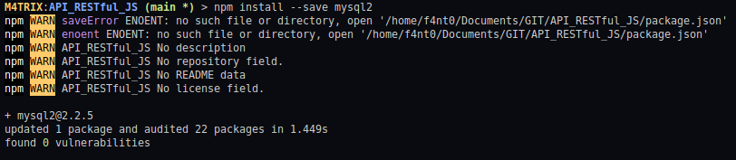

<h1>Glossário</h1>

1. [Página Inicial](https://estudosdofantinho.github.io/API_RESTful_JS/).
2. [O que é uma API](1-O-que-é-uma-api.md).
3. [Como criar um Servidor Inicial](2-Servidor-Inicial.md).
4. [Baixando e Configurando o Express](3-Configurando-Express.md).
5. [Configurando o Sequelize para o Banco de Dados](4-Configurando-Banco-de-Dados.md).
6. [Criando um Model](5-Criando-um-Model.md).
7. [Criando um Controller](6-Criando-um-Controller.md).
8. [Criando um Route](7-Criando-um-Route.md).
9. [Tratamento de Erros Globais](8-Tratamento-de-Erros-Globais.md).
10. [Conectando o Banco de Dados no Servidor](9-Conectando-Banco-de-Dados.md).
11. [Testando a API](10-Testando-a-API.md).

---

# Utilizando o MySQL

### Instalação do mysql2 no Nodejs

* **mysql2** é o módulo que iremos usar junto com o [Sequelize](sequelize).

```shell
> npm install --save mysql2
```



