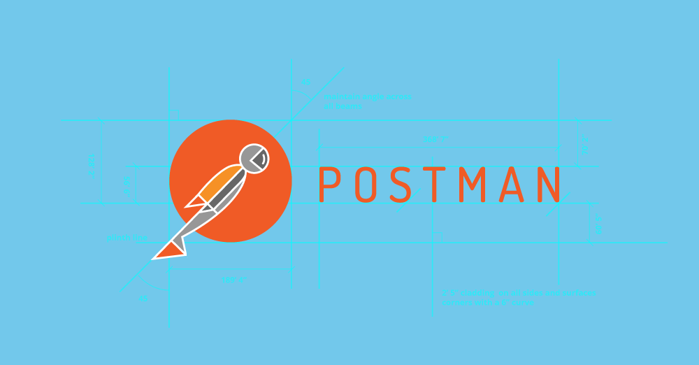
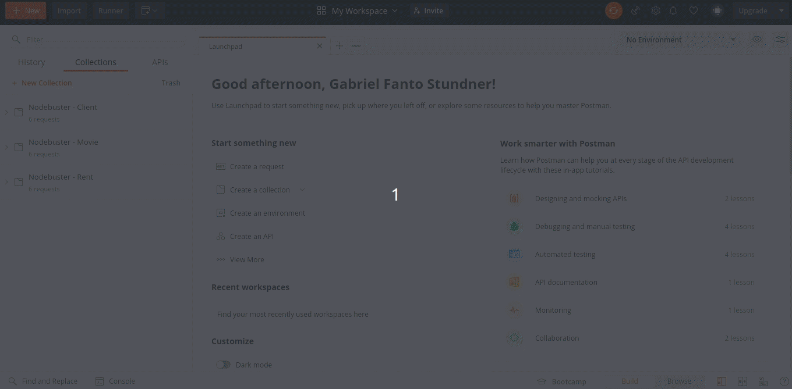

<h1>Glossário</h1>

1. [Página Inicial](https://estudosdofantinho.github.io/API_RESTful_JS/).
2. [O que é uma API](1-O-que-é-uma-api.md).
3. [Como criar um Servidor Inicial](2-Servidor-Inicial.md).
4. [Baixando e Configurando o Express](3-Configurando-Express.md).
5. [Configurando o Sequelize para o Banco de Dados](4-Configurando-Banco-de-Dados.md).
6. [Criando um Model](5-Criando-um-Model.md).
7. [Criando um Controller](6-Criando-um-Controller.md).
8. [Criando um Route](7-Criando-um-Route.md).
9. [Tratamento de Erros Globais](8-Tratamento-de-Erros-Globais.md).
10. [Conectando o Banco de Dados no Servidor](9-Conectando-Banco-de-Dados.md).
11. [Testando a API](10-Testando-a-API.md).

---

# Como utilizar o Postman

* **Postman** é um programa que auxilia o Desenvolvedor a analisar e testar APIs RESTs na prática, executando as requisições criadas na API. Ele ajuda a testar requisições HTTP sem a necessidade de escrever muito código.

#### Baixando o Postman

* Para baixar o Postman acesse o Site de Download [AQUI](https://www.postman.com/downloads/) e baixe para o seu Sistema Operacional o mais recente.

#### Utilizando o Postman

---

**Alterando o Tema do Postman**

* Para alterar o tema do Postman você deve abrir o programa, clicar na engrenagem na Direita, seleciona a aba _Themes_ e Selecionar o tema desejado, como no Gif abaixo:

---

---

**Requisições(Requests)**

* Com o Postman fazemos requisições HTTP para a API, onde existem os seguintes tipos básicos de Requisições que estarão configuradas na API RESTful que estamos testando:

Requisição|Explicação
|---|---|
 |O Postman vai pegar da API os dados solicitados do banco de dados pela url configurada e vai retornar esses dados em um Formato JSON.
|Podemos criar pelo Postman um dado que vai ser adicionado ao banco de dados, onde fazemos isso em Formato JSON pelo próprio Postman, depois de colocados os dados necessários, enviamos o dado pela url configurada para ser adicionado dados ao banco de dados.
|Com o PUT iremos pegar um dado, normalmente pelo seu ID, e poderemos fazer modificações que quisermos, e depois iremos enviar essas modificações para a url configurada.
|Com o DELETE iremos pegar um dado, normalmente pelo seu ID, e iremos deletar ele do Banco de dados permanentemente.

---
