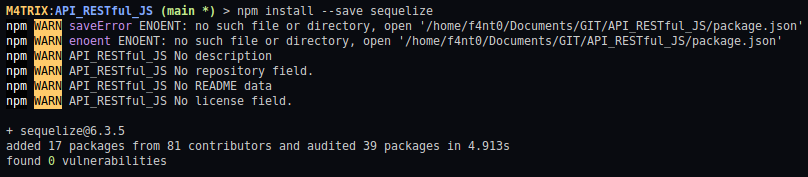
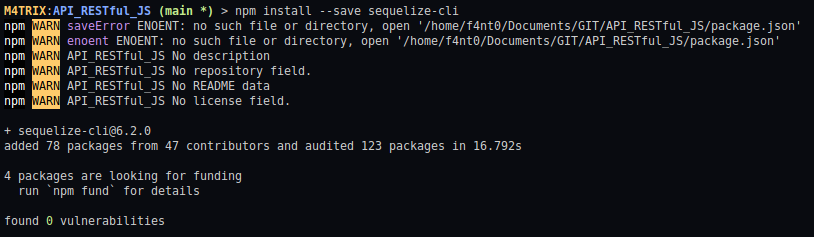

<h1>Glossário</h1>

1. [Página Inicial](https://estudosdofantinho.github.io/API_RESTful_JS/).
2. [O que é uma API](1-O-que-é-uma-api.md).
3. [Como criar um Servidor Inicial](2-Servidor-Inicial.md).
4. [Baixando e Configurando o Express](3-Configurando-Express.md).
5. [Configurando o Sequelize para o Banco de Dados](4-Configurando-Banco-de-Dados.md).
6. [Criando um Model](5-Criando-um-Model.md).
7. [Criando um Controller](6-Criando-um-Controller.md).
8. [Criando um Route](7-Criando-um-Route.md).
9. [Tratamento de Erros Globais](8-Tratamento-de-Erros-Globais.md).
10. [Conectando o Banco de Dados no Servidor](9-Conectando-Banco-de-Dados.md).
11. [Testando a API](10-Testando-a-API.md).

---

# Entendo e utilizando o Sequelize

### Instalando Sequelize no Nodejs

* O Sequelize necessita do módulo `mysql2` para funcionar, por isso ele é baixado primeiro:

```shell
> npm install --save mysql2
```

* O Sequelize possui dois módulos que são baixados, um deles é o `sequelize` e o outro é o `sequelize-cli`:
  * `sequelize` é o principal para ser baixado, é ele que iremos usar para construir o nosso projeto
  * `sequelize-cli` é um auxiliar de comandos no terminal que nos ajuda a facilitar alguns trabalhos

```shell
> npm install --save sequelize
```

```shell
> npm install --save sequelize-cli
```

---



---



---

